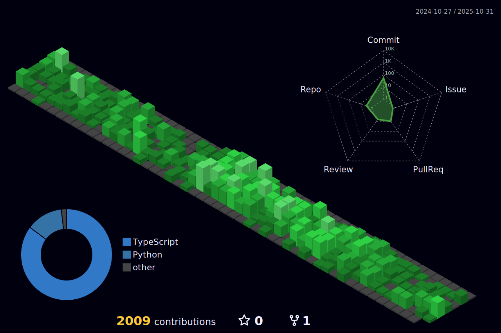

# Hey there! 👋

 

## It's me! Haroon Jawad.
#### I'm a Fullstack JavaScript developer 
#### *Passionate about Web development, Web analytics, Software Design*
## More about me:

- 🔥 Worked on several enterprise level React, Node.js applications, Top rated Fullstack developer on Upwork
- 📫 Always looking to find creative solutions to optimize processes, solve new problems
- 🔭 Actively looking for new opportunities as React, MERN developer
- 📚 I'm currently learning System design and architecture

